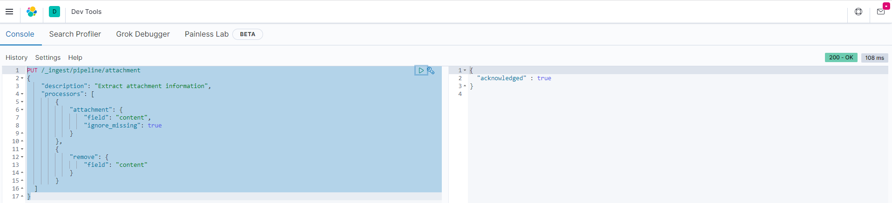

# 全文档在Linux环境下的部署（基于DockerCompose)


>   DockerCompose 是最简单的全文档在Linux下的部署方式，使用Docker compose 脚本即可完成部署。


## docker 环境搭建及使用

参考文档。


## docker-compose 环境搭建及使用

参考文档。


### 部署前准备

#### 下载部署包

拉取源码，在项目中有docker文件夹。

```shell
git clone https://github.com/Jarrettluo/document-sharing-site.git
```

文件夹的结构如下：其中data中是各类中间件的数据文件夹，数据存储位置即该文件夹；esplugin 对应的是elasticsearch的插件文件夹；其他文件是辅助文件。


将安装文件夹<em>自行打包</em>后上传到服务器指定文件夹。建议放置的位置最好是空间比较大的数据盘。

例如打包为`all-docs-docker.zip`后，在服务器上使用unzip进行解压。注意打包文件夹只是为了一次性把所需文件上传到服务器，也可以使用其他办法。

```shell
unzip all-docs-docker.zip
```


进入到安装目录，并查看全部文件。如果发现data下缺少各类空文件，请参照上图进行补充。

```shell
cd all-docs-docker && ls
```


#### 拉取全文档应用的镜像

全文档的镜像包括前端和后端两个镜像。可以对源码打包all-docs、all-docs-web的docker镜像。

本项目在GitHub已经设置了自动推送镜像到Dockerhub，所以您也可以按照如下指令拉取最新的公共镜像：

```shell
docker pull jarrettluo/all-docs
docker pull jarrettluo/all-docs-web
```


其他中间件也需要拉取

```shell
docker pull redis
docker pull elasticsearch:7.9.3
docker pull kibana:7.9.3
docker pull mongo
```

> 这里使用的redis和mongo保持最新版本即可，或者选择已有的版本。
> es和kibana选择与docker-compose.yml中对应文件

#### Elasticsearch

- 需要设置系统内核参数，否则会因为内存不足无法启动。在即将部署的机器上运行执行如下设置。

```shell
# 改变设置
sysctl -w vm.max_map_count=262144
# 使之立即生效
sysctl -p
```

- 检查安装目录下存在文件夹`/data/elasticsearch/data` ，如果缺少，请创建目录并设置权限，否则会因为无权限访问而启动失败。

```shell
# 创建目录
mkdir data/elasticsearch/data/

# 创建并改变该目录权限
chmod 777 data/elasticsearch/data
```


#### 环境变量

docker-compose.yml依赖环境变量，默认使用`.env`环境变量。用户可以对环境变量进行查看及修改。默认情况下无需修改。
在本仓库的部署文件夹下包含了一个`install.conf`的配置文件，用户可打开查看。

```shell
# 重命名安装配置文件为环境变量文件
mv install.conf .env

# 查看环境变量信息
vim .env
```

默认的环境变量如下，其中前端暴露的端口即8080，可以在这里进行修改。修改后记得保存。如下参数只是示例，可能根据版本升级，参数发生了变化。


### 执行docker-compose.yml脚本

将该文件上传的linux服务器上，执行docker-compose up命令即可启动全文档所依赖的所有服务。

```yml
version: '2.1'
services:
  ad_mongodb:
    image: mongo
    container_name: ad_mongo
    restart: always
    ports:
      - ${AD_MONGO_PORT}:27017
    volumes:
      - ./data/mongo/configdb:/data/configdb
      - ./data/mongo/db:/data/db
      - ./data/mongo/log:/var/log/mongodb  # 挂载日志目录
    #初始化管理员用户名和密码
    environment:
     MONGO_INITDB_ROOT_USERNAME: ${AD_MONGO_USER}
     MONGO_INITDB_ROOT_PASSWORD: ${AD_MONGO_PWD}
     MONGO_INITDB_DATABASE: ${AD_MONGO_DATABASE}
    tty: true

  ad_elasticsearch:
    image: elasticsearch:7.9.3
    container_name: ad_elasticsearch
    restart: always
    environment:
      - "cluster.name=elasticsearch" #设置集群名称为elasticsearch
      - "discovery.type=single-node" #以单一节点模式启动
      - "ES_JAVA_OPTS=-Xms512m -Xmx1024m" #设置使用jvm内存大小
    volumes:
      - ./data/elasticsearch/data:/usr/share/elasticsearch/data:rw
      - ./data/elasticsearch/logs:/user/share/elasticsearch/logs:rw
      - ./esplugins:/usr/share/elasticsearch/plugins
    ports:
      - ${AD_ES_PORT}:9200

  kibana:
    image: kibana:7.9.3
    container_name: ad_kibana
    links:
      - ad_elasticsearch:elasticsearch #可以用es这个域名访问elasticsearch服务
    depends_on:
      - ad_elasticsearch #kibana在elasticsearch启动之后再启动
    environment:
      - "elasticsearch.hosts=http://elasticsearch:9200" #设置访问elasticsearch的地址
    ports:
      - 5601:5601

  ad_redis:
    image: redis:latest
    container_name: ad_redis
    # 使用配置文件进行启动，可以选择性设置密码requirepass
    command: redis-server /etc/redis/redis.conf
    ports:
      - ${AD_REDIS_PORT}:6379
    volumes:
      - ./data/redis:/data
      - ./data/redis/redis.conf:/etc/redis/redis.conf

  ad_server:
    image: jarrettluo/all-docs:${AD_SERVER_IMAGE_TAG}
    container_name: ad_server
    environment:
      - REDIS_HOST=${AD_REDIS_HOST}
      - REDIS_PORT=${AD_REDIS_PORT}
      - REDIS_USER=${AD_REDIS_USER}
      - REDIS_PWD=${AD_REDIS_PWD}
      - MONGO_HOST=${AD_MONGO_HOST}
      - MONGO_PORT=${AD_MONGO_PORT}
      - MONGO_USER=${AD_MONGO_USER}
      - MONGO_PWD=${AD_MONGO_PWD}
      - ES_HOST=${AD_ES_HOST}
      - ES_PORT=${AD_ES_PORT}
      - ES_USER=${AD_ES_USER}
      - ES_PWD=${AD_ES_PWD}
      - 'TZ="Asia/Shanghai"'
    ports:
      - ${AD_SERVER_PORT}:8082
    healthcheck:
      test: ["CMD", "nc", "-zv", "localhost", "8082"]
      interval: 6s
      timeout: 10s
      retries: 20
    depends_on:
      - ad_mongodb
      - ad_redis

  ad_web:
    image: jarrettluo/all-docs-web:${AD_SERVER_IMAGE_TAG}
    container_name: ad_web
    external_links:
      - ad_server:ad-server
    ports:
      - ${AD_WEB_PORT}:80
    depends_on:
      - ad_server
```

yml文件配置完毕以后，接下来指定文件运行容器。

```shell
docker-compose -f docker-compose.yml up -d
```

启动完毕以后应该可以看到一系列的容器出现`start`状态。
可以查看容器的日志。
```shell
# 查看全部的docker-compose 日志
docker-compose logs
```

[注意] 这里查看的日志不能出现error一类的报错，特别注意redis和mongo 是否已经连接上。


### 对依赖服务进行以下设置

#### elasticsearch

需要安装中文分词器IKAnalyzer，并重新启动。

注意下载与Elasticsearch对应的版本。安装目录已经存在`elasticsearch-analysis-ik-7.9.3.zip`，需要解压到指定目录。

```shell
# 在安装目录的esplugin中创建文件夹
cd esplugin && mkdir analysis-ik

# 退出到安装目录
cd ..

# 解压缩到指定文件夹
unzip elasticsearch-analysis-ik-7.9.3.zip -d ./esplugin/analysis-ik/
```

```shell
docker restart ad_elasticsearch
```


`Ingest Attachment Processor Plugin`是一个文本抽取插件，本质上是利用了`Elasticsearch`的`ingest node`功能，提供了关键的预处理器`attachment`。

```shell
docker exec -it ad_elasticsearch /bin/sh
```

进入容器后，在安装目录下运行以下命令即可安装。

```shell
./bin/elasticsearch-plugin install ingest-attachment
```


重新启动服务

```shell
docker restart ad_elasticsearch
```


### kibana

默认情况下，浏览器下访问：http://xxx:5601，可查看到kibana。
> 关于kibana的时候请自行查询相关资料。
定义文本抽取管道。

```shell
PUT /_ingest/pipeline/attachment
{
    "description": "Extract attachment information",
    "processors": [
        {
            "attachment": {
                "field": "content",
                "ignore_missing": true
            }
        },
        {
            "remove": {
                "field": "content"
            }
        }
    ]
}
```

在`attachment`中指定要过滤的字段为`content`，所以写入`Elasticsearch`时需要将文档内容放在`content`字段。

运行结果如图：




#### 建立文档结构映射

文本文件通过预处理器上传后以何种形式存储，我们需要建立文档结构映射来定义。PUT定义文档结构映射的时候就会自动创建索引，所以我们先创建一个`docwrite`的索引。

```shell
PUT /docwrite
{
  "mappings": {
    "properties": {
      "id":{
        "type": "keyword"
      },
      "name":{
        "type": "text",
        "analyzer": "ik_max_word"
      },
      "type":{
        "type": "keyword"
      },
      "attachment": {
        "properties": {
          "content":{
            "type": "text",
            "analyzer": "ik_smart"
          }
        }
      }
    }
  }
}

```

在 `ElasticSearch` 中增加了`attachment`字段，这个字段是`attachment`命名`pipeline`抽取文档附件中文本后自动附加的字段。这是一个嵌套字段，其包含多个子字段，包括抽取文本 content 和一些文档信息元数据。

同是对文件的名字name指定分析器`analyzer`为 `ik_max_word`，以让 `ElasticSearch`在建立全文索引时对它们进行中文分词。


### 所有服务正常启动


