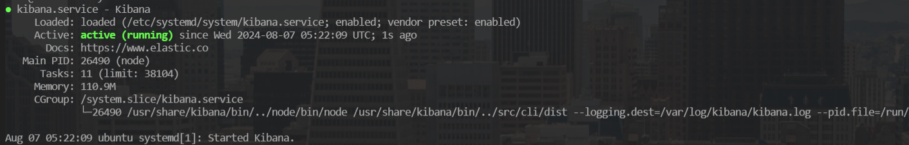

# all-docs（全文档）在Linux环境下部署
本文主要以图文的形式讲解【全文档】项目所需环境在Linux下的安装，主要包括IDEA、Redis、Mongodb、Elasticsearch、Kibana。

# 后端部署

## 准备

- ubuntu 20.04.6 server
- openjdk 1.8

## Maven打包

具体Intellj Idea配置详情见[here](./deploy_win_zh.md)

```bash
git clone https://github.com/Jarrettluo/all-docs.git
cd all-docs
mvn clean package
```

编译打包后生成文件`document-sharing-site-1.0-SNAPSHOT.jar`,将jar拷贝至服务器自定义路径下`/root/backend`

## JDK安装

直接使用apt安装openjdk8

```bash
apt-get install openjdk-8-jdk
java -version
```

输出类似下面的内容代表JDK安装完成,因为使用`apt` 进行安装不需要自行配置环境变量


如果使用压缩包方式安装需要**自行配置环境变量**

## Redis安装

```bash
apt install redis-server
systemctl start redis-server
```

检查redis-server的运行状态

```bash
systemctl status redis
```


设置redis密码

```bash
vim /etc/redis/redis.conf
systemctl stop redis
systemctl start redis
```


## MongoDB安装

```bash
apt-get install gnupg # 安装gnupg软件包
wget -qO - https://www.mongodb.org/static/pgp/server-4.4.asc | sudo apt-key add - # 导入公钥
echo "deb [ arch=amd64,arm64 ] https://repo.mongodb.org/apt/ubuntu bionic/mongodb-org/4.4 multiverse" | sudo tee /etc/apt/sources.list.d/mongodb-org-4.4.list # 添加存储库
apt-get update # 更新缓存
apt install mongodb-org # 安装monogdb
systemctl start mongod.service # 启动服务
systemctl enable mongod # 开机启动
systemctl status mongod # 查看运行状态
```


安装成功后,可以使用如下命令进行连接测试

```bash
mongo --eval 'db.runCommand({ connectionStatus: 1 })'
```


## Elasticsearch安装

```bash
apt install apt-transport-https ca-certificates # 安装依赖
wget -qO - https://artifacts.elastic.co/GPG-KEY-elasticsearch | sudo apt-key add - # 导入软件源的 GPG
sudo sh -c 'echo "deb https://artifacts.elastic.co/packages/7.x/apt stable main" > /etc/apt/sources.list.d/elastic-7.x.list'
apt update # 更新缓存
apt install elasticsearch
systemctl enable elasticsearch # 开机自启动
systemctl start elasticsearch # 启动服务
systemctl status elasticsearch # 查看服务运行状态
```


使用如下命令测试elasticsearch连通性

```bash
curl -X GET "localhost:9200/"
```


## Kibana安装

```bash
apt install kibana 
systemctl enable kibana
systemctl start kibana
systemctl status kibana
```



配置远程访问

```bash
vim /etc/kibana/kibana.yml
systemctl restart kibana
```


配置文本抽取管道

`Ingest Attachment Processor Plugin`是一个文本抽取插件，本质上是利用了`Elasticsearch`的`ingest node`功能，提供了关键的预处理器`attachment`。在安装目录下运行以下命令即可安装。

```
/usr/share/elasticsearch/bin/elasticsearch-plugin install ingest-attachment
systemctl start elasticsearch.service
```

安装插件后需要重启下elasticsearch

```bash
systemctl stop elasticsearch
systemctl start elasticsearch
```

在kibana中`Dev Tools`进行操作

```
PUT /_ingest/pipeline/attachment
{
    "description": "Extract attachment information",
    "processors": [
        {
            "attachment": {
                "field": "content",
                "ignore_missing": true
            }
        },
        {
            "remove": {
                "field": "content"
            }
        }
    ]
}
```

在`attachment`中指定要过滤的字段为`content`，所以写入`Elasticsearch`时需要将文档内容放在`content`字段

## 启动后端

配置环境变量启动jar包

```bash
nohup env AD_PROHIBITED_WORD=false \
AD_USER_REGISTRY=false \
AD_INITIAL_USERNAME=admin \
AD_INITIAL_PASSWORD=your_password \
REDIS_PWD=your_redis_password \
java -jar document-sharing-site-1.0-SNAPSHOT.jar > all.log 2>&1 &
```


# 前端部署

##  准备

- nodejs v14
- nginx

## 安装nodejs

```bash
curl -o- https://raw.githubusercontent.com/nvm-sh/nvm/v0.39.7/install.sh | bash
nvm install 14
node -v # should print `v14.21.3`
npm -v # should print `6.14.18`
```

## 打包前端代码

```bash
git clone https://github.com/Jarrettluo/all-documents-vue
cd all-documents-vue/
```

切换至华为镜像源加速访问

```bash
npm config set registry https://mirrors.huaweicloud.com/repository/npm/
npm cache clean -f
npm config list
```

修改./src/api/request.js文件中的baseURL为线上地址

```bash
nvim src/api/request.js
```


打包前端代码

```bash
npm run build
```

## 安装nginx

```bash
apt install nginx
systemctl start nginx
systemctl enable nginx
```

需要配置下nginx根目录和开放端口,例如

```bash
nvim /etc/nginx/conf.d/all-docs.conf
```

conf文件内容为

```
server {
    server_name  all-docs;
    listen 19001 # 自定义开放端口

    location / {
        root   /usr/share/nginx/html;
        index index.html;
        try_files $uri $uri/ $uri.html =404;
    }
}
```

## 部署前端包

```bash
cp -r dist/* /usr/share/nginx/html/
systemctl restart nginx
```

尝试访问`http://服务器IP:19001`


